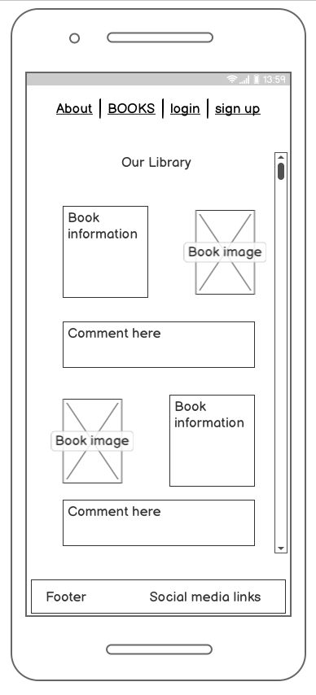
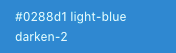
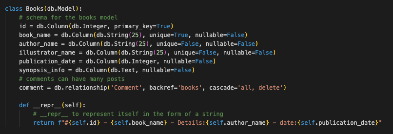

# Contents
* [1 UX Design](#1-ux-design)
    * [1.1 User Stories](#11-user-stories)
* [2 Strategy](#2-strategy)
    * [2.1 Developers Project](#21-developers-project)
    * [2.2 Business](#22-business)
    * [2.3 Users](#23-users)
* [3 Scope](#3-scope)
    * [3.1 Features](#31-features)
    * [3.2 Future Updates](#32-future-updates)
* [4 Structure](#4-structure)
    * [4.1 Initial Page Structure](#41-initial-page-structure)
* [5 Skelaton](#5-skeleton)
    * [5.1 Wireframes](#51-wireframes)
    * [5.2 The Home Page](#52-the-home-page)
    * [5.3 The Library Page](#53-the-library-page)
    * [5.4 The Sign-up Page](#54-the-sign-up-page)
    * [5.5 The Login Page](#55-the-login-page)
    * [5.6 The Users Profile Page](#56-the-users-profile-page)
* [6 Surface](#6-surface)
    * [6.1 Visual Design](#61-visual-design)
    * [6.2 Colours](#62-colours)
    * [6.3 Typography](#63-typography)
    * [6.4 Images](#64-images)
* [7 Database](#7-database)
    * [7.1 Tables](#71-tables)

# 1 Ux design

## 1.1 User Stories

### Consumer user stories

As a user I want to..

1.    Have a clear and straightforward view of the selection of the books, the books information and synopsis and other users comments. 
2.	Manage a personal account allowing me to add, edit and remove content.
3.	View my contributions view my personal account
4.	Navigate the site with easy on all formats.

[Back to top](#contents)

### Business user stories

As a business I want to..

1.	To have a clear interactive layout
2.	Have access to multiple social media links
3.	Have simple colour scheme, representative of the books cover art.
4.	Have the site accessible across all devices. 
5.	Have a admin process to monitor behaviour and manage content.

[Back to top](#contents)

### Developers’ user stories

As a web developer I want to..

1.	provide an easily manageable interactive user experience
2.	have a site that is compliant with W3C guidelines and PEP8 in python
3.	provide well commented code for future updates
4.	have concise use of relational and non-relational databases

[Back to top](#contents)

# 2 Strategy

## 2.1 Developers Project

The aim for this project is to produce a fan site for David Walliams books. Users will be able to register an account for. From there the user can add their own personal comments on the library of books, edit and delete comments and upload new/ additional books to the site. With a simple and readable format, the site will be easy to navigate.

[Back to top](#contents)

## 2.2 Business

To provide a great social media experience enabling users to interact and share comments on their favourite David Walliams books. Giving the users the ability to add content to page managed by an admin account.

[Back to top](#contents)

## 2.3 Users

The aim is to give users a simple and clear user platform to engage in discussions and review the books available. The user can manage their comments with add, edit, and delete options and add new material to the book library page that it added when the administrator of the page enables the new listing.

[Back to top](#contents)

# 3 Scope

## 3.1 Features

The following list of objectives it designed to achieve a well-balanced website that meets the needs and requirements of the business and users strategy outcomes. Within the designated time scale the following criteria will be introduced to the website on initial release.

-	Registration form to sign up for a user profile.
-	A login section
-	Users profile page with logout option
    -	A tally of comments the user has made
    -	An option to add books and information with admin release prompt.
    -	A tally of books added to the library
-	A scrolling library page with book images, information, and comment section
-	A welcome homepage 

[Back to top](#contents)

## 3.2 Future Updates

?? to be added 

[Back to top](#contents)

# 4 Structure

The feature acknowledged from the scope plane will be implemented into the structure of the website.

[Back to top](#contents)

## 4.1 Initial Page Structure

-	The navigation bar will consist of 
-	A home link which will send the user back to the welcome page
-	A library page which palls data from a relation database and displays book information. 
-	A login link which will transfer the user a login field input page
-	A sign up link that will send the user to the sign up field input page
-	The footer will contain links to social media accounts 
-	The home page will have a description about the site. Advise on how to interact with other users and how to registers for an account.
-	The library page will have a list of books, images, information on each book and a comment section for users interact
-	The login link with an email and password fields to access pre-registers users profile page
-	A profile page with a tally chart of comments the user has added and books the user has added to the library
-	The sign up page with input fields for creating a user’s account. 

[Back to top](#contents)

# 5 Skeleton

## 5.1 Wireframes 

The wireframes for the website were created using Balsamiq Wireframes. Using the structure plane the following mock-ups were generated.

[Back to top](#contents)

## 5.2 The Home Page

The opening page has a description about the site, its goals, and its available functionality.   There will also be a link to the sign-up page to encourage and enhance usability. 

\
*compressed from 43.6 KB to 12.8 KB via [TinyPNG](https://tinypng.com/)*

\
*compressed from 42.8 KB to 14.8 KB via [TinyPNG](https://tinypng.com/)*

\
*compressed from 44.9 KB to 14.4 KB via [TinyPNG](https://tinypng.com/)*

[Back to top](#contents)

## 5.3 The Library Page

The library page consists of list of book titles, an image of the book and the information associated. Underneath the data there is a comment box enable users to add their views on the books and engage in conversations with other users. The books will be on a continual scroll however the more the data increase a later update for placing the data on multiple pages for easier viewing.

\
*compressed from 42.2 KB to 12.5 KB via [TinyPNG](https://tinypng.com/)*

\
*compressed from 52.4 KB to 17.6 KB via [TinyPNG](https://tinypng.com/)*

\
*compressed from 44.9 KB to 14.4 KB via [TinyPNG](https://tinypng.com/)*

[Back to top](#contents)

## 5.4 The Sign-up Page

To register for an account an input form for personal information is provided. The user can access this with a link via the navbar and the home page. This will be a input form.

\
*compressed from 40.7 KB to 11.1 KB via [TinyPNG](https://tinypng.com/)*

\
*compressed from 41.4 KB to 13.5 KB via [TinyPNG](https://tinypng.com/)*

\
*compressed from 47.6 KB to 15.6 KB via [TinyPNG](https://tinypng.com/)*

[Back to top](#contents)

## 5.5 The Login Page

The format for this is like the sign-up page for familiarity. The user will use their email address and their password to access their personal account.

\
*compressed from 40.7 KB to 11.6 KB via [TinyPNG](https://tinypng.com/)*

\
*compressed from 41.9 KB to 13.9 KB via [TinyPNG](https://tinypng.com/)*

\
*compressed from 47.4 KB to 16.1 KB via [TinyPNG](https://tinypng.com/)*

[Back to top](#contents)

## 5.6 The Users Profile Page

The profile page will have the name an image and a tally of comments the user has made and books the user has uploaded to the library.

\
*compressed from 26.9 KB to 6.9 KB via [TinyPNG](https://tinypng.com/)*

\
*compressed from 28.5 KB to 8.3 KB via [TinyPNG](https://tinypng.com/)*

\
*compressed from 40.0 KB to 11.5 KB via [TinyPNG](https://tinypng.com/)*

[Back to top](#contents)

# 6 Surface

## 6.1 Visual Design 

The visual design for the website covers the colours, fonts, effects, and images.

[Back to top](#contents)

## 6.2 Colours

The colours selected for the website where generated from [coolors.com](https://coolors.co/palette/577590-f3ca40-f2a541-f08a4b-d78a76). The colour are set using HEX placement values.

\
*compressed from 28.6 KB to 8.3 KB via [TinyPNG](https://tinypng.com/)*

When using the [materialize](https://materializecss.com/) design services the colour generated are not directly hex place accurate to the above sample. However the [coolors.com](https://coolors.co/palette/577590-f3ca40-f2a541-f08a4b-d78a76) website provides a good blue print for colour selection. To regenerate the style above the following colour are to be impemented within the website using [materialize](https://materializecss.com/color.html) availibility. 

\
*compressed from 4.3 KB to 977 B via [TinyPNG](https://tinypng.com/)*

\
*compressed from 4.3 KB to 968 B via [TinyPNG](https://tinypng.com/)*

\
*compressed from 4.2 KB to 968 B via [TinyPNG](https://tinypng.com/)*

\
*compressed from 3.9 KB to 968 B via [TinyPNG](https://tinypng.com/)*

\
*compressed from 4.6 KB to 1.1 KB via [TinyPNG](https://tinypng.com/)*

[Back to top](#contents)

## 6.3 Typography

The font type used throughout the website is as follows.

Heading and Titles
Caveat regular 400, medium 500, semi-bold 600, bold 700

Paragraphs 

Work sans thin 100, extra light 200, light 300, regular 400.

\
*compressed from 86.6 KB to 26.0 KB via [TinyPNG](https://tinypng.com/)*

[Back to top](#contents)

## 6.4 Images

Home page image downloaded form [swindon advertiser](https://www.swindonadvertiser.co.uk/news/16103604.comedian-david-walliams-talks-book-gangsta-granny/#gallery0)

[Back to top](#contents)

<!-- update -->
# 7 Database 

postgres was installed locallt to create a database and SQLAlcemy was installed to work with python to add data to tables and query the database.

The database name dw_fan_site

[Back to top](#contents)

## 7.1 Tables

### Books 

The model.py schema 

Adding books to the database - routes.py

Editing books in the database - routes.py

Deleting books from the database - routes.py

[Back to top](#contents)

### Users

The model.py schema

Sign-up new users - routes.py

Login - routes.py

<!---update

[Back to top](#contents)

# 7 Testing

Click the [link](TESTING.md) for testing.

[Back to top](#contents)

# 8 Deployment

 # 9 Technologies used
- [HTML 5](https://en.wikipedia.org/wiki/HTML5) 
- [CSS](https://en.wikipedia.org/wiki/CSS)
- [JS](https://en.wikipedia.org/wiki/JavaScript)
- [Python](https://en.wikipedia.org/wiki/Python_(programming_language))
- [Balsamiq](https://balsamiq.com/wireframes/desktop/#)
- [gitpod](https://www.gitpod.io/)
- [github](https://github.com/Hayley-Woodhouse/Milestone-3-project)
- [W3 Schools](https://www.w3schools.com/)
- [Heroku](https://www.heroku.com/)
- [Mongodb](https://www.mongodb.com/)
- [Flask](https://en.wikipedia.org/wiki/Flask_(web_framework))

# 10 Credits

- [materialize](https://materializecss.com/)
- [Font awesome](https://fontawesome.com/) was used for all icons.
- [Google fonts](https://fonts.google.com/) was used for the fonts within the website.
- [Favicon](https://favicon.io/emoji-favicons/books) was used for the favicon image.
- [W3S](https://validator.w3.org/) was used to validate the html and css files.

[Back to top](#contents)

# 11 Acknowledgements

This web site was created for the second milestone project for the full stack development diploma with the code instatute and harlow college.

With thanks to 

Precious Ljege for the mentor assistants, advice and support.

Philip Morris for the tuition and guidence.

Richard and Isla Woodhouse for support and user testing.

[Back to top](#contents)

--->

