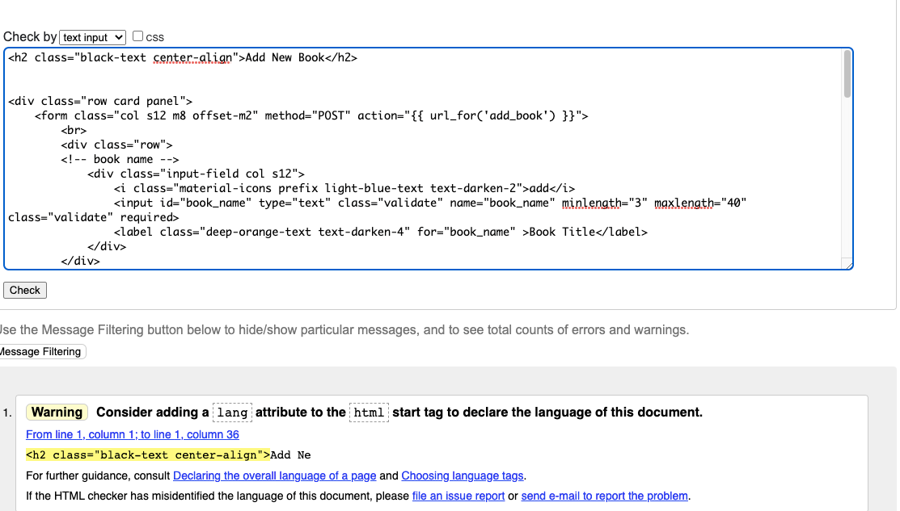
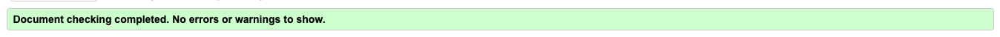
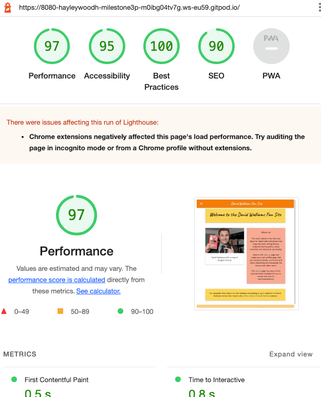

# Testing 

# Contents

* [1 W3C Validation](#1-w3c-validation)
    * [1.1 index.html](#11-indexhtml)
     * [1.2 style.css](#12-stylecss)
* [2 Responsiveness](#2-responsiveness)
* [3 Browsers](#3-browsers)
* [4 Lighthouse](#4-lighthouse)
* [5 Testing user stories](#5-testing-user-stories)
    * [5.1 Consumer user stories](#51-consumer-user-stories)
    * [5.2 Business user stories](#52-business-user-stories)
    * [5.3 Developers user stories](#53-developers-user-stories)
* [6 Bugs](#6-bugs)
* [7 Updates](#7-updates)

# 1 W3C Validation

The html and css pages were validated using [W3S](https://validator.w3.org/)

A few warnings where detected due to the materialize language.

\
[Back to top](#contents)

With these warning ignore the html passed validation.

\
[Back to top](#contents)

## 1.2 style.css

The css passed Validation.

\
[Back to top](#contents)

# 2 Responsiveness

The sites responsive design was tested using Google Crome and firefox devTools

|| Small Mobile | Med Mobile | Tablet | Laptop | Large Laptop | Desktop |
| --- | --- | --- | --- | --- | --- | --- | 
| site | Pass |Pass | Pass | Pass | Pass | Pass |
| images | Pass |Pass |Pass |Pass |Pass |Pass |

[Back to top](#contents)

# 3 Browsers

 Google Chrome
- Microsoft Edge
- Safari  
- Mozilla Firefox 

[Back to top](#contents)

# 4 Lighthouse
The results from the Google Lighthouse performance tests are as follows. 

\
[Back to top](#contents)

# 5 Testing user stories

The user stories helped to identify the key information and nav, layout and colour scheme aspects of the website during the design process. The following review of these stories helps to highlight the value of the features.

[Back to top](#contents)

### 5.1 Consumer user stories

As a user I want to..

1.    Have a clear and straightforward view of the selection of the books, the books information and synopsis and other users comments. 
### Answer
This is avalible to all users on the library page.

2.	Manage a personal account allowing me to add, edit and remove content.
### Answer 
A signup and login requirement allows users to add and remove comments.

3.	View my contributions view my personal account
### Answer
All comments a user makes are added to the library and the users personal profile page.

4.	Navigate the site with easy on all formats.
### Answer
Navigation on large screens is readable and on small screens is avalible from a hamburger menu.

[Back to top](#contents)

### 5.2 Business user stories

As a business I want to..

1.	To have a clear interactive layout
### Answer
The loyout is simple and easy to navigate around the page.

2.	Have access to multiple social media links
### Answer
Social media links are provided in the footer

3.	Have simple colour scheme, representative of the books cover art.
### Answer
The colour scheme is bright and represents the david walliams books/style well.

4.	Have the site accessible across all devices. 
### Answer
The site renders well on all templates

5.	Have a admin process to monitor behaviour and manage content.
### Answer
A admin login direct to the admin profile page. from there the admin user can maintain control of the users behavior and remove users if necessary.

[Back to top](#contents)

### 5.3 Developers’ user stories

As a web developer I want to..

1.	provide an easily manageable interactive user experience
### Answer
The site is controlled by the admin user. It is a simple layout for young David walliams fans to enjoy.

2.	have a site that is compliant with W3C guidelines and PEP8 in python
### Answer
The site is complient and well tested.

3.	provide well commented code for future updates
### Answer
All code is commented and clear for future updates.

4.	have concise use of relational and non-relational databases
### Answer
The site uses a relational database. a non-relational may be used for the future update requirements.

[Back to top](#contents)

# 6 Bugs

| Test number | Description | Expectation | Outcome | Pass/Fail | Comments |
| --- | --- | --- | --- | --- | --- |
| 1 | check for flask instulations | print message to screen | outcome as expected | pass | 
| 2 | submit button within add_book.html not working | to push input text to database | submit button does not render properly | fail | 
| 3 | submit button within add_book.html | to push input text to database | submit button workin | pass | A layout issue with the html form page |

[Back to top](#contents)

# 7 Updates

Future updates recognised for the webpage is as follow:

- adding update/edit CRUD functionality for the users comments.

This will enable the user to edit their comments. Currently users can only create, read and delete.

- Authentication

Currently we are using cookies as the authentication tokens. This is an insecure method of authenticating users. An immediate update would require a using flask login which has been installed ready for the update.